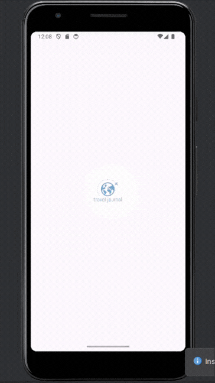

# Kotlin Final Project 

## Introduction

This project is a comprehensive Android application developed as part of a final project. The application allows users to manage items with features including adding, editing, and deleting items, marking favorites, and viewing item details. The app also incorporates location and camera services, enabling users to attach photos and location data to each item.

## Demo

## Features

- **Add Item**: Users can add new items with a title, description, date, image, and location.
- **Edit Item**: Users can edit the details of existing items.
- **Delete Item**: Swipe left to delete an item.
- **Mark Favorite**: Toggle items as favorites.
- **View Details**: Click on an item to view detailed information.
- **Location Services**: Attach the current location to an item.
- **Camera Integration**: Take a photo or choose an existing one to attach to an item.

## Architecture and Technologies

### MVVM (Model-View-ViewModel)

The project follows the MVVM architectural pattern, which helps in separating the development of the graphical user interface from the development of the business logic or back-end logic.

### Room

Room is used as the persistence library to manage the local SQLite database. It provides an abstraction layer over SQLite to allow fluent database access while harnessing the full power of SQLite.

### LiveData

LiveData is used for observable data holders. This component of the Android Jetpack is lifecycle-aware, meaning it respects the lifecycle of other app components, such as activities, fragments, or services. This awareness ensures that LiveData only updates app component observers that are in an active lifecycle state.

### ViewModel

ViewModel is designed to store and manage UI-related data in a lifecycle-conscious way. The ViewModel allows data to survive configuration changes such as screen rotations.

### Location Services

The application uses location services to get the user's current location and attach it to the items.

### Camera Services

Camera services are used to capture images that can be attached to the items.

## Project Structure

The project is divided into several packages for better organization:

- **data**: Contains all the data models and Room database classes.
- **ui**: Contains all the UI-related classes, including fragments and activities.
- **viewmodel**: Contains the ViewModel classes that handle the business logic and data preparation for the UI.

## How to Use

1. **Add a New Item**: Click on the "Add Item" button, fill in the details, take or select a photo, and click "Finish".
2. **Edit an Item**: Long press on an item to enter the edit mode and update the details.
3. **Delete an Item**: Swipe left on an item in the list to delete it.
4. **Mark as Favorite**: Click the favorite icon on an item to mark or unmark it as a favorite.
5. **View Item Details**: Click on an item to view its detailed information.
6. **Attach Location**: Click on the location button to attach your current location to an item.
7. **Capture Image**: Click on the camera button to capture a new image for an item.

## Dependencies

- [Android Jetpack](https://developer.android.com/jetpack)
- [Room](https://developer.android.com/jetpack/androidx/releases/room)
- [LiveData](https://developer.android.com/topic/libraries/architecture/livedata)
- [ViewModel](https://developer.android.com/topic/libraries/architecture/viewmodel)
- [Glide](https://github.com/bumptech/glide) for image loading

## License

This project is licensed under the MIT License. See the LICENSE file for more details.
